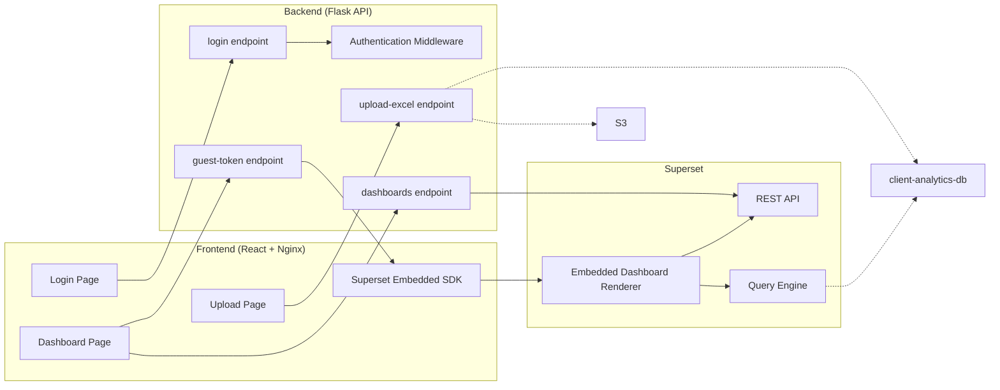

# Speegile Analytics – System Architecture

```mermaid
graph LR

    subgraph "Frontend (React + Nginx)"
        LOGIN["Login Page"]
        DASH["Dashboard Page"]
        UPLOAD["Upload Page"]
        SDK["Superset Embedded SDK"]
    end

    subgraph "Backend (Flask API)"
        AUTH["Authentication Middleware"]
        LOGIN_EP["login endpoint"]
        DASH_EP["dashboards endpoint"]
        TOKEN_EP["guest-token endpoint"]
        UPLOAD_EP["upload-excel endpoint"]
    end

    subgraph "Superset"
        API["REST API"]
        EMBED["Embedded Dashboard Renderer"]
        QUERY["Query Engine"]
    end

    LOGIN --> LOGIN_EP
    LOGIN_EP --> AUTH

    DASH --> DASH_EP
    DASH_EP --> API

    DASH --> TOKEN_EP
    TOKEN_EP --> SDK

    SDK --> EMBED
    EMBED --> API
    EMBED --> QUERY

    UPLOAD --> UPLOAD_EP
    UPLOAD_EP -.-> S3["S3"]
    UPLOAD_EP -.-> DB["client-analytics-db"]

    QUERY -.-> DB
```