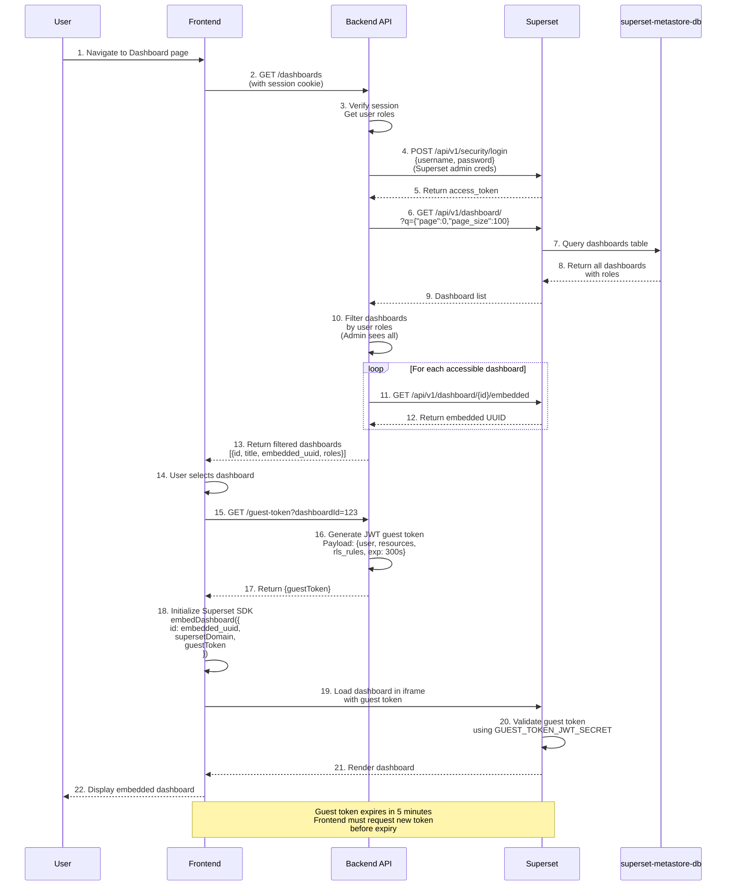

```mermaid
sequenceDiagram
    participant U as User
    participant F as Frontend
    participant B as Backend API
    participant S as Superset
    participant DB as superset-metastore-db
    
    U->>F: 1. Navigate to Dashboard page
    F->>B: 2. GET /dashboards<br/>(with session cookie)
    
    B->>B: 3. Verify session<br/>Get user roles
    B->>S: 4. POST /api/v1/security/login<br/>{username, password}<br/>(Superset admin creds)
    S-->>B: 5. Return access_token
    
    B->>S: 6. GET /api/v1/dashboard/<br/>?q={"page":0,"page_size":100}
    S->>DB: 7. Query dashboards table
    DB-->>S: 8. Return all dashboards<br/>with roles
    S-->>B: 9. Dashboard list
    
    B->>B: 10. Filter dashboards<br/>by user roles<br/>(Admin sees all)
    
    loop For each accessible dashboard
        B->>S: 11. GET /api/v1/dashboard/{id}/embedded
        S-->>B: 12. Return embedded UUID
    end
    
    B-->>F: 13. Return filtered dashboards<br/>[{id, title, embedded_uuid, roles}]
    
    F->>F: 14. User selects dashboard
    F->>B: 15. GET /guest-token?dashboardId=123
    
    B->>B: 16. Generate JWT guest token<br/>Payload: {user, resources,<br/>rls_rules, exp: 300s}
    B-->>F: 17. Return {guestToken}
    
    F->>F: 18. Initialize Superset SDK<br/>embedDashboard({<br/>  id: embedded_uuid,<br/>  supersetDomain,<br/>  guestToken<br/>})
    
    F->>S: 19. Load dashboard in iframe<br/>with guest token
    S->>S: 20. Validate guest token<br/>using GUEST_TOKEN_JWT_SECRET
    S-->>F: 21. Render dashboard
    F-->>U: 22. Display embedded dashboard
    
    Note over F,S: Guest token expires in 5 minutes<br/>Frontend must request new token<br/>before expiry
```