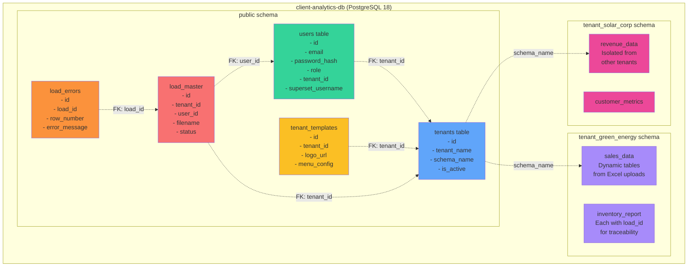

```mermaid
graph TB
    subgraph "client-analytics-db (PostgreSQL 18)"
        subgraph "public schema"
            TENANTS[tenants table<br/>- id<br/>- tenant_name<br/>- schema_name<br/>- is_active]
            USERS[users table<br/>- id<br/>- email<br/>- password_hash<br/>- role<br/>- tenant_id<br/>- superset_username]
            TEMPLATES[tenant_templates<br/>- id<br/>- tenant_id<br/>- logo_url<br/>- menu_config]
            LOAD_MASTER[load_master<br/>- id<br/>- tenant_id<br/>- user_id<br/>- filename<br/>- status]
            LOAD_ERRORS[load_errors<br/>- id<br/>- load_id<br/>- row_number<br/>- error_message]
        end
        
        subgraph "tenant_green_energy schema"
            T1_TABLE1[sales_data<br/>Dynamic tables<br/>from Excel uploads]
            T1_TABLE2[inventory_report<br/>Each with load_id<br/>for traceability]
        end
        
        subgraph "tenant_solar_corp schema"
            T2_TABLE1[revenue_data<br/>Isolated from<br/>other tenants]
            T2_TABLE2[customer_metrics]
        end
    end
    
    USERS -.->|FK: tenant_id| TENANTS
    TEMPLATES -.->|FK: tenant_id| TENANTS
    LOAD_MASTER -.->|FK: tenant_id| TENANTS
    LOAD_MASTER -.->|FK: user_id| USERS
    LOAD_ERRORS -.->|FK: load_id| LOAD_MASTER
    
    TENANTS -.->|schema_name| T1_TABLE1
    TENANTS -.->|schema_name| T2_TABLE1
    
    style TENANTS fill:#60A5FA
    style USERS fill:#34D399
    style TEMPLATES fill:#FBBF24
    style LOAD_MASTER fill:#F87171
    style LOAD_ERRORS fill:#FB923C
    style T1_TABLE1 fill:#A78BFA
    style T1_TABLE2 fill:#A78BFA
    style T2_TABLE1 fill:#EC4899
    style T2_TABLE2 fill:#EC4899
```