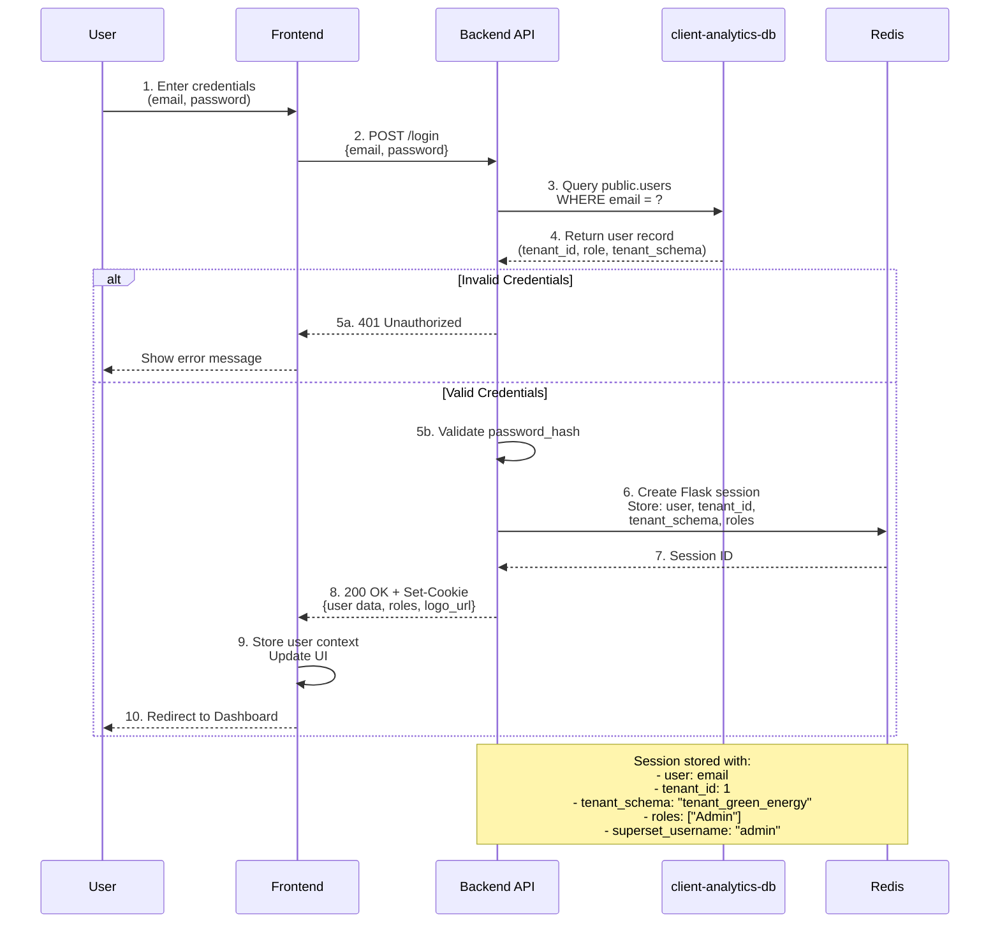

```mermaid
sequenceDiagram
    participant U as User
    participant F as Frontend
    participant B as Backend API
    participant DB as client-analytics-db
    participant R as Redis
    
    U->>F: 1. Enter credentials<br/>(email, password)
    F->>B: 2. POST /login<br/>{email, password}
    
    B->>DB: 3. Query public.users<br/>WHERE email = ?
    DB-->>B: 4. Return user record<br/>(tenant_id, role, tenant_schema)
    
    alt Invalid Credentials
        B-->>F: 5a. 401 Unauthorized
        F-->>U: Show error message
    else Valid Credentials
        B->>B: 5b. Validate password_hash
        B->>R: 6. Create Flask session<br/>Store: user, tenant_id,<br/>tenant_schema, roles
        R-->>B: 7. Session ID
        
        B-->>F: 8. 200 OK + Set-Cookie<br/>{user data, roles, logo_url}
        F->>F: 9. Store user context<br/>Update UI
        F-->>U: 10. Redirect to Dashboard
    end
    
    Note over B,R: Session stored with:<br/>- user: email<br/>- tenant_id: 1<br/>- tenant_schema: "tenant_green_energy"<br/>- roles: ["Admin"]<br/>- superset_username: "admin"
```